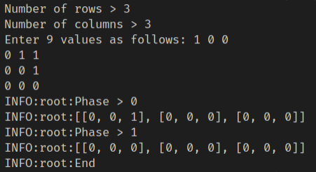

# game_of_life


Another wibbily wobbly timey wimey...stuff related with [Conway's game of life](https://conwaylife.com/).

## Requirements
1. Any live cell with less than 2 live neighbors dies (under population)
2. Any live cell with 2 or 3 live neighbors lives (next generation)
3. Any live cell with +3 live neighbors dies (over population)
4. Any dead cell with 3 live neighbors becomes live cell (reproduction)

## Example
```
stage_0 = [[0,1,1],[0,0,1],[0,0,0]]
stage_1 = [[0,0,1],[0,0,0],[0,0,0]]
```

## How to test it
There is a simple interface to enter the matrix values and test the next stage (only one, work in progress).
```
python game_of_life.py
```
Here is a input example:


